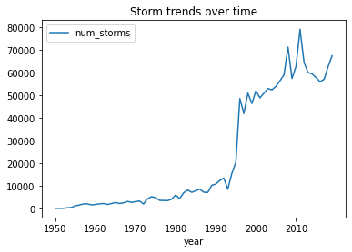

+++
title="Patrones de Diseño en ML"
date=2023-03-04

[taxonomies]
categories = ["MLarchitecture"]
tags = ["Mldesign"]
+++

# **Patrones de Machine Learning**

¡Hola! En primer lugar, me embarco en un viaje para destacar los principales aspectos presentados en el libro "[Machine Learning Design Patterns](https://www.oreilly.com/library/view/machine-learning-design/9781098115777/)". Esta serie está dirigida a ingenieros de machine learning, ingenieros de datos y científicos de datos. Omitiré la explicación de la terminología básica y me centraré en los matices de enfrentar los desafíos más comunes al desplegar modelos de machine learning. El concepto de patrones fue introducido en el campo de la ingeniería civil/arquitectura por Christopher Alexander y cinco coautores en el libro titulado "A Pattern Language" (1977). La idea principal es que en una situación que ocurre recurrentemente, el patrón describe la solución central para este contexto y puede aplicarse varias veces para este u otros similares. Aquí, exploraremos los patrones más generales que pueden aplicarse al diseño de sistemas de machine learning.

<!-- more -->

---

Sin embargo, no podemos proceder sin definir los desafíos más comunes en ML:

## **Calidad de Datos**

Como ya sabrás, en ML aplica "Basura entra, basura sale", debemos verificar la precisión, completitud, consistencia y oportunidad de los datos.

* **Precisión de datos** se refiere al gran y arduo trabajo que realizan los ingenieros de datos. Estos ingenieros juegan un papel esencial en verificar y manejar errores tipográficos, entradas duplicadas, inconsistencias de medición, características faltantes y las particularidades de datos no estructurados. Por ejemplo, los duplicados pueden llevar al modelo a asignar más peso a esas muestras duplicadas durante el aprendizaje. Además, ejemplos de entrenamiento etiquetados incorrectamente introducen sesgo en el modelo.
* **Completitud de Datos** asegura que tus datos de entrenamiento contengan una representación variada de cada etiqueta. Tiene el mismo efecto en el aprendizaje que los ejemplos duplicados en los datos de entrenamiento. Para lidiar con problemas de precisión y completitud de datos, deberías realizar un Análisis Exploratorio de Datos (EDA). Te animo a echar un vistazo a Pandas profile o Dtale para facilitar este análisis.
* **Consistencia de datos** es otro aspecto común del machine learning. Como sabes, en el aprendizaje supervisado, necesitas datos etiquetados, así que aquí, deberíamos solicitar datos etiquetados o comenzar a etiquetarlos. El problema surge cuando los etiquetadores introducen sesgo, especialmente si los datos requieren conocimiento del dominio (como en imágenes médicas). Una técnica común es dividir el trabajo entre un grupo de personas, luego tener múltiples personas etiquetando cada ejemplo y tomar la etiqueta más comúnmente aplicada (veremos esto en profundidad en el patrón de diseño Fairness Lens). Las características inconsistentes también se consideran en esta sección ya que pueden cambiar con el tiempo (piensa en sensores con diferentes offset de calibración).
* **Oportunidad** en datos se refiere a la latencia entre la ocurrencia del evento y la adición a la base de datos. Es más importante en aplicaciones de machine learning en tiempo real, así que en este caso, deberías registrar tantos datos como sea posible. Por ejemplo, agregar una marca de tiempo cuando se generó un punto de datos y cuando se agregó al almacenamiento.

## **Reproducibilidad**

El machine learning, a diferencia del software tradicional, tiene un elemento inherente de aleatoriedad. Por ejemplo, los pesos de las matrices se inicializan con valores aleatorios, por lo que el modelo converge a diferentes salidas para diferentes ejecuciones de entrenamiento. Esto puede dificultar ejecutar comparaciones entre experimentos. Fijar un valor para seed puede resolver este problema.

Entrenar un modelo de ML involucra varios artefactos que necesitan fijarse para asegurar la reproducibilidad: los datos utilizados, el mecanismo de división usado para generar conjuntos de datos para entrenamiento y validación, preparación de datos e hiperparámetros del modelo, y variables como tamaño de lote y programación de tasa de aprendizaje. También aplica a las dependencias del framework de ML. Ejecutar cargas de trabajo de ML en contenedores y estandarizar versiones de bibliotecas puede ayudar a asegurar la repetibilidad.

## **Deriva de Datos**

La deriva de datos es un concepto importante en ML, especialmente en producción. La deriva de datos se refiere al desafío de asegurar que tus modelos de machine learning permanezcan relevantes. Para resolver la deriva, es esencial actualizar continuamente tu conjunto de datos de entrenamiento, reentrenar tu modelo y modificar el peso que tu modelo asigna a grupos particulares de datos de entrada. El análisis exploratorio de datos es una técnica requerida aquí para entender el comportamiento de los datos. Por ejemplo, predecir la probabilidad de una tormenta requiere explorar los datos disponibles de los sensores para este escenario. En la siguiente imagen, podemos ver que entrenar un modelo con datos anteriores al 2000 llevaría a predicciones inexactas.

> Copyright 2020 Google Inc. Licenciado bajo la Licencia Apache, Versión 2.0 (la "Licencia"); no puedes usar este archivo excepto en cumplimiento con la Licencia. Puedes obtener una copia de la Licencia en [http://www.apache.org/licenses/LICENSE-2.0](http://www.apache.org/licenses/LICENSE-2.0) A menos que lo requiera la ley aplicable o se acuerde por escrito, el software distribuido bajo la Licencia se distribuye "TAL CUAL", SIN GARANTÍAS O CONDICIONES DE NINGÚN TIPO, ya sean expresas o implícitas. Consulta la Licencia para el idioma específico que rige los permisos y limitaciones bajo la Licencia.

## **Escala**

Encontrarás desafíos de escalado en diferentes fases de tu aplicación de ML, como recolección y preprocesamiento de datos, entrenamiento y servicio. El tamaño de tus datos dictará las herramientas requeridas para tu solución. Los ingenieros de ML son responsables de determinar la infraestructura necesaria para un trabajo de entrenamiento específico. Si tu conjunto de datos es lo suficientemente grande, el entrenamiento del modelo puede ser costoso en tiempo y computacionalmente. En el contexto del servicio de modelos, la infraestructura requerida para soportar un equipo de científicos de datos obteniendo predicciones es completamente diferente de la infraestructura necesaria para soportar un modelo en producción para millones de predicciones por hora. Veremos resiliencia y reproducibilidad en los capítulos 6 y 7.

## **Múltiples Objetivos** (El gran desafío oculto)

Los modelos en producción introducen un gran desafío para un ingeniero de ML porque el modelo está siendo usado por diferentes equipos/roles en la organización. Teniendo este escenario, veremos que definir un modelo exitoso no es fácil. Cada usuario/equipo/rol tiene su propia definición de un modelo exitoso dadas sus necesidades. Por ejemplo, un científico de datos/investigador de ML está interesado en minimizar la función de pérdida del modelo. El gerente de proyecto está interesado en generar valor vinculando este modelo a los productos de la organización, así que aquí empezamos a lidiar con cómo definir un KPI que imite el comportamiento de la función de pérdida. Finalmente, el equipo ejecutivo está interesado en aumentar los ingresos usando este modelo pero entienden el KPI más que una función matemática como la función de pérdida. Como viste, es responsabilidad del científico de datos trabajar junto con el gerente de proyecto para definir este KPI, luego llevarlo al equipo ejecutivo.

## Gracias

Querido [James Clark](https://www.linkedin.com/in/jameshclrk/), solo quería tomarme un momento para agradecerte por inspirarme/ayudarme a comenzar mi propio blog personal. Tu blog, https://jamesclark.dev/, ha sido una fuente de inspiración para mí, y tu disposición a compartir tus experiencias y conocimientos ha sido invaluable. Gracias a tu guía, ahora tengo una plataforma para expresar mis pensamientos, compartir mis ideas y conectar con otros que comparten mis pasiones. Tu apoyo y aliento han sido instrumentales para ayudarme a comenzar, y estoy verdaderamente agradecido por todo lo que has hecho por mí. ¡Gracias de nuevo por todo, James!
