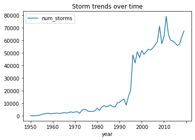

+++
title="Ml patterns design"
date=2023-03-04

[taxonomies]
categories = ["MLarchitecture"]
tags = ["Mldesign"]
+++

# **Machine Learning Patterns**

Hi, first of all, I am going to start this journey where I am going to highlight the main aspects showed in this book [Machine Learning Design Patterns](https://medium.com/r?url=https%3A%2F%2Fwww.oreilly.com%2Flibrary%2Fview%2Fmachine-learning-design%2F9781098115777%2F). This series is intended to machine learning engineers, data engineers, and data scientists. I am going to skip the explanation of basic terminology so we could focus just on the nuance to face the most common challenges in deploying machine learning models.
The concept of patterns was introduced in the field of civil engineering/architecture by Christopher Alexander and five coauthors in the book titled A Pattern Language (1977).
The main concept is that in a situation that happens recurrently, the pattern describes the core solution for this context and can be applied several times for this or similar ones. So here we're going to catch up the most general patterns that can be applied to ML system design. 

<!-- more -->

---

However we can't proceed until define the most common challenges in ML:

## **Data Quality**

As you know in ML "Garbage in, garbage out", so in data quality we must to check accuracy, completeness, consistency and timeliness

* **Data accuracy** refers to the great and harness job that data engineer came out. This great guy plays an important role in checking/handling typos, duplicates entries, measurement inconsistencies, missing features and the particularities of unstructured data. For instance, duplicates can lead to the model assign more weight to those duplicated samples during the learning. Also, incorrectly labeled training examples introduce bias in the model.
* **Data Completeness** is ensuring your training data contains a varied representation of each label. It has the same effect in the learning as the duplicated examples in the training data. To deal with data accuracy and completeness issue you should perform and EDA (Exploratory Data Analysis), I encourage you to take a look at Pandas profile or Dtale to ease this analysis.
* **Data consistency** is another aspect very common in ML. As you know, in supervised learning you need labeled data, so here we should ask for labeled data or start labeling it. The problem comes with the bias labelers introduce, especially if the data requires domain knowledge (like in medical images). One common technique is divide the work among a group of people, then have multiple people labeling each example and take the most commonly applied label ( We will see this deeply in Fairness Lens pattern design). Inconsistent features are also considered on this section as they can change over time (think about sensors with different offset of calibration).
* **Timelines** in data refers to latency between the event occurrence and the addition to the database. It is more important in real time ML application so in this case, you should record as much data as possible, for example adding a timestamp when data point was generated and when it was added to the storage.

## **Reproducibility**

ML, unlike traditional software, have an inherent element of randomness.
For example, matrix weights are initialized with random values, so the model converge to different outputs for different training execution.
This can make it difficult to run comparisons across experiment (fix a value for seed solve this issue).

Training an ML model involves several artifacts that need to be fixed in order to ensure reproducibility:
the data used, the splitting mechanism used to generate dataset for training and validation, data preparation and model hyperparameters,
and variables like batch size and learning rate schedule.
It also applies to ML frameworks dependencies. Running ML workloads in containers and standardizing library versions can help ensure repeatability.

## **Data Drif**

Data drift is an important concept in ML, specially in production. Data drift refers to the challenge of ensuring your machine learning models stay relevant. To solve for drift, it’s important to continually update your training dataset, retrain your model, and modify the weight your model assigns to particular groups of input data. Exploratory data analysis is technique required here to understand the behavior of the data, you can’t work with data that you don’t understand. For example, predicting the likelihood of a storm, we need explore the data available from the sensors for this scenario. In the next image we can see that training training a model on data before 2000 would lead to inccurate predictions

> Copyright 2020 Google Inc. Licensed under the Apache License, Version 2.0 (the "License"); you may not use this file except in compliance with the License. You may obtain a copy of the License at [http://www.apache.org/licenses/LICENSE-2.0](http://www.apache.org/licenses/LICENSE-2.0) Unless required by applicable law or agreed to in writing, software distributed under the License is distributed on an "AS IS" BASIS, WITHOUT WARRANTIES OR CONDITIONS OF ANY KIND, either express or implied. See the License for the specific language governing permissions and limitations under the License.

## **Scale**

You will encounter scaling challenges in different phases of you ML application, such as data collection and preprocessing, training, and serving. The size of your data willl dictate the tooling required for your solution. ML engineer are responsible for determining the neccesary infrastructure for a specific training job. If your dataset is big enough, model training can be time consuming and computationally expensive.

In the context of model serving, the infrastructure required to support a team of data scientist getting predictions is entirely different from the infrastructure necessary to support a production model for millions of predictions by hour. We will see resilience and reproducibility in chapter 6 and 7.

## **Multiple Objectives** (The hidden big challenge)

Model in production introduce a big challenge for Ml engineer because the model is being used by different teams/roles in the organization. Having this scenario, we will see that defining a sucessful model is not easy. Each user/team/role has his own definition of a success model given his needs.

For example, a data scientist/ML research is interest in minimize the loss function of the model. The project manager is interested in generate value by linking this model into the organization products, so here we start dealing with how to define a KPI that mimics the behavior of the loss function. Finally, the executive team is insterested in increase the revenue by using this model but they understand the KPI more that a mathematical function like loss function.

As you saw, it is responsability of the data scientist work together with the project manager to define this KPI, then move this into executive team.
